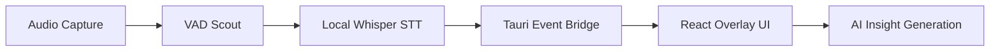

# 🐺 Akela

> **The Invisible AI Meeting Assistant** — Local-first, zero-friction, and completely invisible to screen capture.

Akela is a high-performance Windows overlay assistant that transcribes meeting audio in real-time and provides contextual AI insights without ever leaving your active window.

[](https://www.microsoft.com/windows)
[](LICENSE)
[](ROADMAP.md)

---

## ⚡ Features

- **Dual-Stream Audio Engine**: Simultaneous capture of your Microphone and System (Meeting) audio using WASAPI Loopback.
- **Local STT Engine**: Real-time transcription using a local Whisper model—your conversations never leave your machine.
- **Stealth Overlay**: A glassmorphism capsule UI that is **completely invisible** to OBS, Zoom, Google Meet, and screenshots.
- **Contextual AI**: One-click to analyze recent conversation context using OpenAI, Gemini, or local models.
- **Zero-Focus Interaction**: Always-on-top, but never steals keyboard focus or appears in Alt+Tab or in taskbar.

---

## 🏗️ System Architecture

Akela is built for performance and privacy. It leverages Rust for heavy lifting and React for a fluid UI.



See the [Full Architecture Documentation](docs/architecture.md) for more details.

---

## 🛠️ Quick Start

### Prerequisites
- **Windows 10/11**
- **Rust Toolchain**: [Install Rust](https://www.rust-lang.org/tools/install)
- **Bun**: [Install Bun](https://bun.sh/)
- **VS Build Tools**: C++ Desktop Development workload.

### Installation
```bash
# Clone the repository
git clone https://github.com/srsoumyax11/Akela.git
cd Akela

# Install dependencies
bun install

# Run in development mode
bun tauri dev
```

---

## 📚 Documentation

Detailed technical guides:
- 🏗️ [Architecture Overview](docs/architecture.md)
- 🎙️ [Audio Pipeline](docs/audio-pipeline.md)
- 🖥️ [Native Overlay System](docs/overlay-system.md)
- 🗄️ [Database Schema](docs/database-schema.md)

---

## 🗺️ Roadmap

We are currently in **Phase 2: Audio Engine Optimization**.
Check our [Detailed Roadmap](ROADMAP.md) for upcoming features like:
- [ ] Adaptive Voice Activity Detection (VAD)
- [ ] Local Knowledge Base integration
- [ ] Custom System Prompts

---

## 🤝 Contributing

We welcome contributions! Please see our [Contributing Guide](CONTRIBUTING.md) for setup instructions and coding standards.

Please abide by our [Code of Conduct](CODE_OF_CONDUCT.md).

---

## 🛡️ Security & Privacy

Privacy is our core value. 
- **No Servers**: Transcripts are processed and stored locally in a SQLite database.
- **Your Keys**: You own your API keys. They are stored securely on your machine.
- **Invisible**: The overlay cannot be captured by screen-sharing software.

See [SECURITY.md](SECURITY.md) for vulnerability reporting.

---

## ⚖️ License

Distributed under the **MIT License**. See [LICENSE](LICENSE) for more information.
Copyright (c) 2026 Akela Contributors.