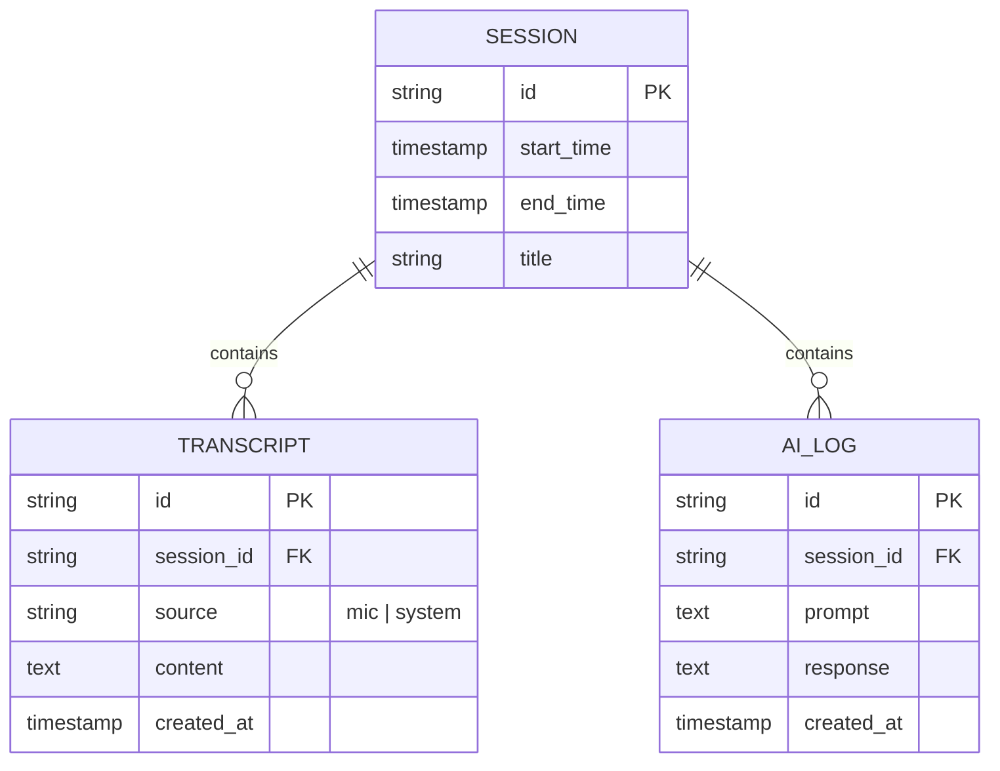

# Database Schema

Akela uses **SQLite** for local, privacy-first data persistence. This ensures all your meeting transcripts and AI insights stay on your machine.

---

## Entity Relationship Summary

The database is structured around **Sessions**. Each time you start the audio engine, a new session is created. Transcripts and AI interactions are linked to these sessions.

---

## Tables

### 1. `sessions`
Records each unique "recording session."
- `id` (UUID, Primary Key)
- `title` (Optional, defaults to timestamp)
- `start_at` (ISO8601 Timestamp)
- `end_at` (ISO8601 Timestamp, nullable)

### 2. `transcripts`
Stores the finalized text segments from the STT engine.
- `id` (UUID, Primary Key)
- `session_id` (UUID, Foreign Key)
- `source` (Text: `mic` or `system`)
- `content` (Text)
- `timestamp_ms` (Integer: milliseconds from session start)
- `created_at` (ISO8601 Timestamp)

### 3. `ai_logs`
Records the interactions with AI providers.
- `id` (UUID, Primary Key)
- `session_id` (UUID, Foreign Key)
- `prompt` (Text: the full context sent to the AI)
- `response` (Text: the AI's generated response)
- `provider` (Text: `openai`, `gemini`, etc.)
- `created_at` (ISO8601 Timestamp)

---

## Migration Strategy
We use a simple versioned migration system.
- Migrations are stored as `.sql` files in the Rust backend.
- On startup, the app checks the `user_version` PRAGMA and applies missing migrations sequentially.
